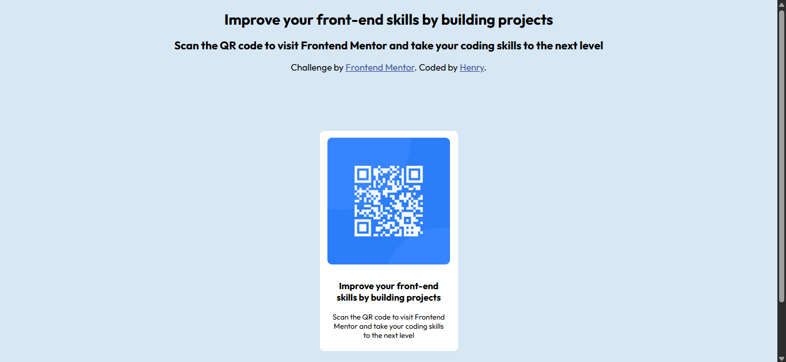

# Frontend Mentor - QR code component solution

This is a solution to the [QR code component challenge on Frontend Mentor](https://www.frontendmentor.io/challenges/qr-code-component-iux_sIO_H). Frontend Mentor challenges help you improve your coding skills by building realistic projects.

## Table of contents

- [Overview](#overview)
  - [Screenshot](#screenshot)
  - [Links](#links)
- [My process](#my-process)
  - [Built with](#built-with)
  - [What I learned](#what-i-learned)
  - [Continued development](#continued-development)
- [Author](#author)
-

## Overview

### Screenshot

### Links

- Solution URL: [solution URL ](https://github.com/Noma7code/frontend-mentor-qr-code-project.git)
- Live Site URL: [live site URL ](https://frontend-mentor-qr-code-project-nu.vercel.app/)

## My process

### Built with

- Semantic HTML5 markup
- CSS custom properties
- Flexbox
- Google Fonts (Outfit)
- Mobile-first workflow

### What I Learned

Through this project, I learned how to:

- Use Flexbox to vertically and horizontally center elements.
- Integrate Google Fonts into a web project.
- Apply consistent spacing, font sizing, and alignment for visual appeal.
- Maintain a clean structure using semantic HTML.

### Continued development

-I am looking forward to improving upon my understanding and usage of responsiveness in future projects

- Experiment with animations and interactive design using advanced CSS.

## Author

- Frontend Mentor - [@Noma7code](https://www.frontendmentor.io/profile/Noma7code)
